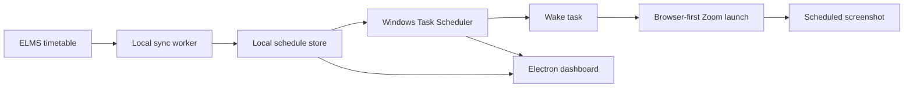

<p align="center">
  
</p>

<h1 align="center">StudentHero</h1>

<p align="center">
  <strong>Your classes. Your schedule. Automatically handled.</strong><br />
  A local-first Windows desktop app for ELMS timetable sync and Zoom class automation.
</p>

<p align="center">
  <a href="https://github.com/sardor1411/students-hero/actions/workflows/ci.yml"></a>
  <a href="https://github.com/sardor1411/students-hero/releases"></a>
   
  <a href="LICENSE"></a>
</p>

<p align="center">
  <a href="#get-started">Get started</a> ·
  <a href="#features">Features</a> ·
  <a href="#releases">Releases</a> ·
  <a href="CONTRIBUTING.md">Contribute</a>
</p>

---

## A calmer way to make class

StudentHero turns a weekly ELMS timetable into a local schedule for online classes. It syncs lesson details and Zoom links, keeps schedules on your Windows PC, and can prepare Windows wake and Zoom launch tasks for upcoming classes.

The dashboard and worker run locally. Your ELMS credentials and schedule data stay on your device; the worker talks to ELMS when it syncs.

## Features

| | |
|---|---|
| 📚 **ELMS timetable sync** | Signs in to ELMS, finds weekly lessons and Zoom links, and reconciles changes without discarding existing schedules when a sync fails. |
| 🗓️ **Flexible scheduling** | Import recurring classes or add one-time, daily, weekday, and custom-day meetings. |
| ⚡ **Windows wake tasks** | Schedules per-class wake tasks with a configurable lead time. Actual wake behavior depends on Windows power settings and device firmware. |
| 🎥 **Layered Zoom launch** | Tries the web link in the default browser and Chrome/Edge, then the Zoom protocol and desktop app, with launch verification and fallback handling. |
| 🔁 **Consecutive classes** | Reconciles individual launch and wake tasks for upcoming occurrences, including closely spaced classes. |
| 📸 **Automatic screenshots** | Captures the Zoom window after a successful launch, falling back to the primary display when needed. Images are stored locally under `screen/`. |
| 🛌 **Hibernate shortcut** | Includes a Windows helper that requests Hibernate; wake timers still depend on the PC's hardware and power configuration. |
| 🖥️ **Desktop dashboard** | Packages the local React dashboard and worker in an Electron Windows application. |

## Screenshots

StudentHero captures screenshots from real Zoom sessions for local review. Those images can contain private class content, so captured sessions are not included in the repository or release assets. Use a synthetic schedule if you contribute a dashboard preview.

## Get started

### Install on Windows

1. Download **StudentHero-Setup.exe** from the [GitHub Releases page](https://github.com/sardor1411/students-hero/releases).
2. Run the installer and allow it to download the app files and dependencies on first launch.
3. Configure worker credentials locally to enable scheduled ELMS sync; see [Windows setup](SETUP.md). The dashboard also supports a separate manual ELMS import.

The installer is for Windows x64 and needs internet access for initial setup and release checks. It maintains a portable Node.js runtime for the local app. The bootstrapper checks the latest published GitHub Release when updates are available.

### Run from source

**Requirements:** Windows x64 for scheduled Zoom/wake automation and Node.js supported by the project.

```powershell
git clone https://github.com/sardor1411/students-hero.git
cd students-hero
npm ci
Copy-Item .env.example .env.local
```

Add your ELMS username and password to `.env.local`, then start the UI and worker in separate terminals:

```powershell
npm run dev
npm run worker
```

For local development, the UI is at `http://localhost:5173` and the worker API binds to `127.0.0.1:8787`. Windows scheduled tasks are installed/reconciled by the worker and can run independently of the dashboard. See [SETUP.md](SETUP.md) for credential storage, task behavior, and Windows wake limitations.

## How it works



The worker syncs ELMS data and reconciles per-occurrence Windows tasks. The dashboard reads the local worker API and displays schedule, launch, wake, sync, and screenshot status. See [the architecture notes](docs/architecture.md) for component boundaries and local data paths.

## Releases

Published releases contain the Windows installer and self-contained x64 application payload.

- `StudentHero-Setup.exe` — Windows installer
- `StudentHero-Windows-x64.zip` — packaged Windows x64 application
- `checksums.txt` — SHA-256 hashes for release downloads

Release binaries are kept in GitHub Releases rather than committed to the source repository.

To build release artifacts locally on Windows, use:

```powershell
npm ci
npm run package:release
```

The generated release output is Git-ignored.

## Troubleshooting

<details>
<summary><strong>ELMS sync fails</strong></summary>

Check the saved local credential, confirm the ELMS account can sign in, and review the local worker logs. Never paste credentials into an issue.
</details>

<details>
<summary><strong>The PC does not wake for class</strong></summary>

Check that Windows wake timers are enabled for the active power plan and that the device/firmware supports waking from its current power state. Hibernate and lid-close behavior vary by hardware.
</details>

<details>
<summary><strong>Zoom does not open automatically</strong></summary>

Keep the computer available at the scheduled time and check the dashboard's launch diagnostics. StudentHero tries several browser and Zoom launch routes, but Windows policies, browser prompts, network access, and Zoom installation can still prevent a meeting from opening.
</details>

<details>
<summary><strong>Where are logs and screenshots?</strong></summary>

The installed app logs to `%LOCALAPPDATA%\StudentsHero\logs`. Source-checkout worker data and screenshots are stored locally under `data/` and `screen/`.
</details>

## Security and privacy

StudentHero stores its worker data locally. Keep `.env.local`, `data/`, and `screen/` private; screenshots can contain meeting content. For improved credential protection on Windows, use `npm run elms:save-credentials` to store credentials with Windows DPAPI. The local worker API binds to loopback and is not intended to be exposed to a network.

See [SECURITY.md](SECURITY.md) for reporting a security issue.

## Contributing

Issues and pull requests are welcome. Please read [CONTRIBUTING.md](CONTRIBUTING.md), include steps to reproduce bugs, and remove account details, tokens, and meeting screenshots from reports.

## License

StudentHero is available under the [MIT License](LICENSE).
